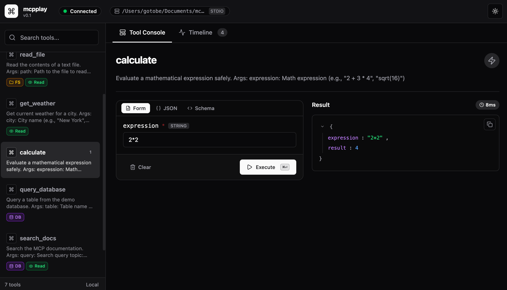

<p align="center">
  
</p>

<h1 align="center">mcpplay</h1>

<p align="center">
    <em>The <code>FastAPI /docs</code> experience, for MCP servers.</em>
</p>

<p align="center">
    <a href="https://github.com/gauthierpiarrette/mcpplay/actions/workflows/ci.yml"></a>
    <a href="https://pypi.org/project/mcpplay/"></a>
    <a href="https://pypi.org/project/mcpplay/"></a>
    <a href="https://github.com/gauthierpiarrette/mcpplay/blob/main/LICENSE"></a>
</p>

<p align="center">
  <a href="https://mcpplay.dev">Documentation</a> • <a href="https://mcpplay.dev/getting-started/">Getting Started</a> • <a href="https://github.com/gauthierpiarrette/mcpplay/issues">Issues</a>
</p>

<p align="center">
  <strong>⚡ Run your MCP server → instantly get an interactive UI.</strong>
</p>

https://github.com/user-attachments/assets/ecaa69d9-b441-44d8-b709-93b168398858

**mcpplay** gives you a browser-based playground for [MCP](https://modelcontextprotocol.io)-compliant servers. One command, and you get auto-generated forms, live results, and a full execution timeline.

Built for [FastMCP](https://github.com/jlowin/fastmcp) workflows. Works with any MCP-compliant implementation.

## Installation

```bash
pip install mcpplay
mcpplay demo
```

Your browser opens to `http://localhost:8321`. That's it!

<p align="center">
  
</p>

### Point it at your own server

```bash
mcpplay run server.py
mcpplay run --command "node server.js"
mcpplay run --command "uvx my-mcp-server"
```

### Options

```bash
mcpplay run server.py --port 9000        # Custom port (default: 8321)
mcpplay run server.py --no-open          # Don't auto-open browser
mcpplay run server.py --no-reload        # Disable hot reload
mcpplay run server.py --env API_KEY=xxx  # Pass env vars to server
```

## Features

- **Schema-aware forms** - auto-generated from your tool's JSON Schema, with enums, nested objects, arrays, and defaults.
- **Live execution** - run tools and see structured results instantly.
- **Persistent timeline** - every call logged with inputs, outputs, and latency. Replay with one click.
- **Hot reload** - edit your server, mcpplay restarts it. Session and timeline preserved.
- **Local-first** - runs on localhost (`127.0.0.1`) with Origin validation. No remote exposure by default.

## Comparison

| | **mcpplay** | MCP Inspector | MCPJam Inspector |
|---|---|---|---|
| **Install** | `pip install` | `npx` (Node required) | Docker |
| **Python native** | ✅ | ❌ | ❌ |
| **Form generation** | Full JSON Schema | Basic inputs | Basic inputs |
| **Hot reload** | ✅ | ❌ | ❌ |
| **Execution timeline** | Persistent, replayable | Log | Log |

## Development

```bash
git clone https://github.com/gauthierpiarrette/mcpplay
cd mcpplay

# Python backend
uv sync --dev
uv run pytest

# Frontend (Svelte)
cd frontend
npm install
npm run dev      # Dev server with HMR
npm run build    # Build to src/mcpplay/static/
```

## License

Apache 2.0
